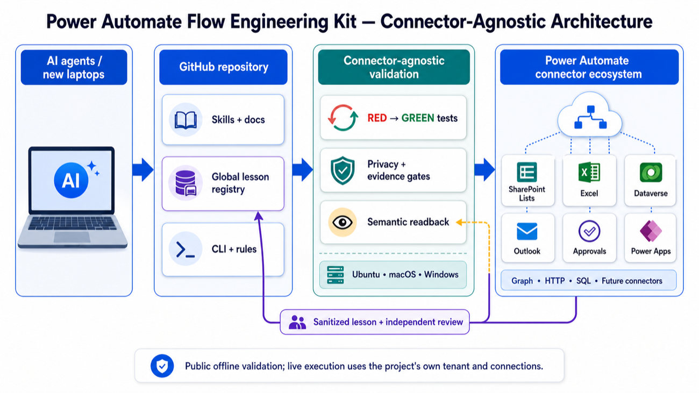

# Power Automate Flow Engineering Kit

Power Automate Flow Engineering Kit is a public, synthetic-data toolkit for designing and validating Power Automate and Power Platform applications across connector-backed systems such as SharePoint, Excel, Power Apps, Dataverse, Outlook, Graph, HTTP, SQL, and approvals.



## Why this exists

Power Automate failures often look green before they are trustworthy: a connection can be `Connected` while the installed reference is stale, or a flow can succeed without the intended semantic effect. This kit turns those failure modes into deterministic RED/GREEN checks that an AI or engineer can reuse across SharePoint, Excel, Dataverse, Outlook, Approvals, Power Apps, Graph, HTTP, SQL, and future connectors.

## Test it in three minutes

Start with the existing [Quick Start](#quick-start), run the local acceptance gate, and inspect the [multi-project control plane](docs/MULTI_PROJECT_CONTROL_PLANE.md). The public path is offline/read-only; a live run requires your own authenticated Power Platform tenant and connections.

If this approach is useful, [star the repository](https://github.com/brunotaisa01-source/power-automate-flow-engineering-kit). Star if useful; open a [GitHub Discussion](https://github.com/brunotaisa01-source/power-automate-flow-engineering-kit/discussions) with a connector, failure mode, or improvement idea.

## Connector matrix

Use the [architecture connector-boundary matrix](docs/architecture/ARCHITECTURE.md#5-connector-boundary) to distinguish the current executable SharePoint reference from the connector-neutral profiles and documentation for Excel, Power Apps, Dataverse, Outlook, Graph, HTTP, SQL, approvals, and future connectors. Tenant runtime evidence remains `NOT_RUN` unless separately recorded.

## Proof and boundaries

The [GitHub Actions CI workflow](.github/workflows/ci.yml) matrix covers Ubuntu, macOS, and Windows. Local checks are synthetic and include the [approved global lesson registry](knowledge/self-improvement/registry.json) and [connector profiles](examples/minimal-public-app/connectors/); the [Dataverse + Power Automate flow runbook](docs/DATAVERSE_FLOW_RUNBOOK.md) describes the live boundary without providing tenant access. Live tenant/UAT/scanner boundaries remain explicit `NOT_RUN` gates, and local GREEN does not prove tenant execution, tenant-wide behavior, publication, or scanner PASS.

This is a public source-available engineering kit under the [Personal and Internal Use License](LICENSE), not an OSI open-source license. Use [CONTRIBUTING.md](CONTRIBUTING.md) for changes, [SECURITY.md](SECURITY.md) for private vulnerability reports, and GitHub Discussions for questions or improvement ideas; no private contact data or support SLA is implied.

The reference profile is:

`frontend -> SharePoint lists -> Power Automate -> SharePoint -> frontend`

The same engineering boundaries apply when the authoritative backend is Excel, Power Apps, Dataverse, or another connector:

`frontend -> connector-backed data/services -> Power Automate -> authoritative systems -> frontend`

The current executable frontend profile is intentionally SharePoint-specific, while the contracts, package/flow rules, evidence model, and self-improvement skill are designed to generalize across Power Automate connectors. The kit gives an AI or engineer a project contract, deterministic artifact inspection, RED/GREEN fixtures, evidence boundaries, and a local CLI. It is designed to prevent common failures before any tenant operation is considered.

The repository does not contain a tenant-connected HTTP backend. The `spflow` CLI is offline/read-only with respect to tenants, and generalized connector contracts and self-improvement documentation do not constitute runtime evidence for Excel, Power Apps, Dataverse, Outlook, Graph, HTTP, SQL, approvals, or future connectors. See the [architecture](docs/architecture/ARCHITECTURE.md) for the complete backend, orchestration, connector-boundary, and evidence model.

## Status

The current implementation contains offline package/flow validation plus WP-06
SharePoint and frontend rules. WP-06 adapters inspect exact frontend source
files, normalize declared Power Automate definitions, verify complete frontend
inventories, and safely inspect native solution ZIP bytes. Repository-authored
evidence, source IR, projections, and JSON stored under a `.zip` name cannot
authorize a production PASS.

WP-15 local hardening recognizes a deliberately narrow executable grammar.
Frontend authority requires a parser-clean, closed module inventory and exact
supported AST shapes whose network calls use the unshadowed
`globalThis.fetch` API. The accepted Save shape rejects empty, unknown, or
undefined patch entries and establishes semantic readback only through a
successful `200` readback status check followed by a field-by-field comparison
of the parsed GET response with the serialized write body. Save, digest, and
OData URLs must be resolved against the configured SharePoint site URL from
the contract binding. The boundary check rejects malformed URLs, credentials,
hashes, arbitrary origins, and sibling site-path prefixes using exact decoded
path segments. A Save obtains `/_api/contextinfo` under that site path and
accepts a digest only from a successful `2xx` response with a non-empty string
value. Pagination parses URLs, enforces the configured site path on exact
decoded segment boundaries, validates a successful `2xx` response and array
body before consuming results, and rejects malformed continuation values. The
accepted OData shape is one allowlisted field equality with escaped
literal data; caller-supplied filter fragments are not accepted. Schema
authority requires a complete contract-bound create payload, including
type-specific Choice, Lookup, and DateTime properties, native SharePoint field
response comparisons, response-bound
FOUND/MISSING/FAILED branches, creation only in MISSING, and post-create GET
readback. Index authority requires a complete
indexed-field read, exact current-state assertion, an approved digest
assertion consumed by the executable plan, serial remove-before-add writes,
per-field ETag reads, exact `POST`/`MERGE`/`IF-MATCH` controls, full
per-step/final readbacks, and a compatible zero-write `NO_OP`. Permission
inheritance is derived only from the accepted executable `break-clear` shape;
grant readback binds principal and role in one assignment, while effective
permissions are checked against native `High`/`Low` masks.
Protected authorization facts are emitted only when Owner and Amount contract
fields are selected by the target GET and consumed by the reachable guard.
  Before any builder section is emitted, every normalized action is inspected;
  an unsupported connector, ambiguous HTTP method, or mutating action outside
  the exact contract-derived action set suppresses the whole builder derivation.
  WP-15 also records control reachability during flow normalization. A
  deterministic `false` condition, including constant contradictions such as
  `equals(1,0)` and nested boolean contradictions, marks its descendant
  actions unreachable; any unreachable action suppresses builder authority.
  Data-dependent conditions remain runtime-conditional and continue through the
  existing structural and lineage checks. Frontend Save authority rejects the
  wildcard ETag and every C0 or DEL header character, including characters
  inside quoted values, before any request is sent.
Unsupported or ambiguous structures produce no trusted derivation. A compiled
CLI process covers the fourteen contract-required WP-06 rules from raw
synthetic files and real ZIP bytes. This is not a release-readiness claim.

WP-16 removes the remaining shared-prefix endpoint assumption. The accepted
frontend source has separate exact grammars for Save item URLs, OData list
URLs, and pagination collection/continuation URLs. Save accepts only the
contract-bound list path followed by `/items(<positive integer>)`; OData accepts
only the exact list path; pagination accepts only that exact collection path,
with a server continuation query allowed. `/fields`, `/items`, extra segments,
resource substitutions, malformed URLs, raw or encoded traversal, and encoded
separators fail closed before any fetch.

`PA-CONNECTOR-001` is method-aware: HTTP GET, HEAD, and OPTIONS actions are
reads and do not require MERGE headers. Recognized item and field updates still
require `POST`, `X-HTTP-Method: MERGE`, and a non-wildcard exact ETag. Unknown
or dynamic HTTP requests and non-read methods fail closed unless they carry the
supported mutation controls.

All results are local evidence only. Tenant import, rebinding, enablement,
execution, mutation, semantic readback, and publication readback are separate
gates and are not performed by this repository.

## License

This repository uses the Personal and Internal Use License in [`LICENSE`](LICENSE).
Personal and internal business use is permitted, but selling, redistributing,
publishing, commercializing, offering a hosted/SaaS service, or transferring
the Software or a substantially similar derivative requires separate written
permission. The project name and trademarks are not licensed for promotion or
endorsement. This is source-available, not an OSI open-source license.

## Quick Start

Requirements:

- Node.js `22.x`
- npm `10.x`
- Use `.nvmrc` with nvm, fnm, or another Node version manager when available.

Install and verify:

```powershell
npm ci
npm run build
npm test
npm run check
```

`npm run check` is the portable acceptance command. It invokes the build, the
complete test inventory, all nine connector profiles, contract/rule/artifact
checks, read-only plugin checks, and the high-severity dependency audit through
Node argument arrays instead of shell-specific loops. The same command runs in
the repository's Linux, macOS, and Windows GitHub Actions matrix.

## Multi-project local control plane

Run isolated, dependency-free checks for the two synthetic workspace projects:

```powershell
node packages/cli/dist/bin/spflow.js workspace check --manifest examples/multi-project-workspace/workspace.manifest.json --format json
```

The manifest, project roots, and governed registry are all rooted at
`examples/multi-project-workspace/`. The aggregate is GREEN only when the
registry audit and every required project are GREEN; a required RED remains
visible while other projects continue independently. An optional missing
project is reported as `NOT_RUN`, and an unresolved registry candidate blocks
all project checks. Read [`docs/MULTI_PROJECT_CONTROL_PLANE.md`](docs/MULTI_PROJECT_CONTROL_PLANE.md)
before adapting the fixture.

## Portable Power Automate Save Boundary

When a raw Power Automate definition is going to an XRM/Flow API save path,
prepare it locally with the exported `@spflow/core/flow-save` helper:

```ts
import { preparePowerAutomateDefinition } from "@spflow/core/flow-save";

const saveDefinition = preparePowerAutomateDefinition(
  rawDefinition,
  connectionReferences,
);
```

The helper is deterministic and offline. It removes only action-level
`inputs.authentication`, derives `host.connectionReferenceName` from the
declared connection-reference map, preserves the connector alias and payload,
and fails closed when a logical reference is missing or ambiguous. It does not
authenticate, call a tenant, publish, enable, or run a flow. This keeps the
same save-boundary behavior on any laptop with Node 22/npm 10.

The public example is a complete, synthetic project. It contains a
contract-bound frontend, a zero-action flow envelope for package inspection,
and exact bundle/package manifests. It contains no tenant values, credentials,
mailboxes, company identifiers, or production exports.

Validate the example project contract:

```powershell
node packages/cli/dist/bin/spflow.js validate contract examples/minimal-public-app/project.contract.json --format text
```

Validate the connector-neutral synthetic profiles for SharePoint, Excel, Power
Apps, Dataverse, Outlook, Graph, HTTP, SQL, and approvals:

```powershell
node packages/cli/dist/bin/spflow.js validate connector examples/minimal-public-app/connectors/excel.profile.json --format text
```

The same command validates every profile under
`examples/minimal-public-app/connectors/`. These profiles prove only local
synthetic operation semantics, status handling, concurrency, retry, idempotency,
mutation closure, and semantic readback; they do not prove tenant connector
availability or execution.

Run the complete product-level offline acceptance journey:

```powershell
node --experimental-strip-types --test tests/integration/product-acceptance.test.ts
```

This test validates the reference contract/rules/artifact path, all nine connector
flow fixtures, payload/permission/pagination/readback behavior, and the automatic
self-improvement cycle from candidate RED through digest-bound promotion and
approved-lesson consumption. It proves only local synthetic runtime behavior.

Validate every shipped local rule against the example (global scope):

```powershell
node packages/cli/dist/bin/spflow.js validate rules --root examples/minimal-public-app --format text
```

Validate only the exact rule IDs declared by the example contract (required-only
scope):

```powershell
node packages/cli/dist/bin/spflow.js validate rules --root examples/minimal-public-app --required-only --format text
```

Global validation evaluates the shipped rule registry. The required-only
command is a bounded contract rule-set check and must never be reported as a
global validation pass.

Validate the example Power Platform solution artifact against its contract:

```powershell
node packages/cli/dist/bin/spflow.js validate artifact examples/minimal-public-app/artifacts/example-solution.zip --contract examples/minimal-public-app/project.contract.json --format text
```

Run the example offline verification command:

```powershell
node packages/cli/dist/bin/spflow.js verify --root examples/minimal-public-app --offline --format text
```

Offline verification must not be interpreted as tenant verification. In an
environment without the official public-data scanner, this command is
expected to return exit `8` with `NOT_RUN=public-data-scanner`; unavailable
engines are never promoted to PASS. Tenant import, rebinding, enablement,
execution, mutation, semantic readback, publication readback, and rule-specific
`LIVE_SMOKE` checks remain explicit `NOT_RUN` gates. Rule-specific
`LIVE_SMOKE NOT_RUN` entries are derived from the required rule IDs and their
shipped catalog metadata; they are not runtime observations.

Use npm run check for a zero-exit local acceptance gate. The offline `verify`
command is an evidence report, so its non-zero exit is intentional when a
requested scanner or external gate is unavailable; do not treat that result as
a broken installation or convert its `NOT_RUN` entries into PASS.

## AI Skill

Install or copy [`skills/power-automate-flow-engineering-kit/SKILL.md`](skills/power-automate-flow-engineering-kit/SKILL.md) into an AI skill directory. It teaches a clean-context AI to read the project contract, derive contract-bound resources, generate operation-specific endpoint helpers, use typed command queues, enforce SharePoint and Power Automate boundaries, handle ETags/readbacks/schema states/indexes/permissions, run RED before GREEN, preserve privacy, and report residual evidence gates. Its documentation TDD records a pressure scenario that is RED without the skill and GREEN with it.

The skill is advisory and agent-neutral: it invokes the same `spflow` contracts and CLI. It never authorizes tenant mutation and never uses a write-capable MCP.

The companion [`power-automate-flow-engineering-kit-self-improvement` skill](skills/power-automate-flow-engineering-kit-self-improvement/SKILL.md) automatically loads the connector-agnostic lesson registry for Power Automate and Power Platform work, including Excel, Power Apps, Dataverse, Outlook, Graph, HTTP, SQL, approvals, and future connectors. It captures new RED/review findings as sanitized candidates; only independently approved lessons become global instructions. Audit it with:

```powershell
node packages/cli/dist/bin/spflow.js learn audit knowledge/self-improvement/registry.json --format text
```

An open candidate intentionally returns exit `1` until its executable RED/GREEN/positive-control and independent review gates pass.

The approved global lessons include `runtime-binding-authority`: a physical
`Connected` status is not enough. A future AI must also confirm that the
current and installed logical/physical references match and that the generated
data-source alias equals the full alias registered by the host. This lesson is
connector-neutral, synthetic-public, and consumed through the registry on every
new laptop; provider, hosted, and UAT evidence remains project-local.

## Read-Only Plugin

Install the local synthetic read-only plugin skill from the public repository:

```powershell
npx --yes skills add https://github.com/brunotaisa01-source/power-automate-flow-engineering-kit --skill power-automate-flow-engineering-kit-readonly --global --agent codex --copy --yes
```

The plugin contract exposes only `getManifest`, registry reads, candidate status,
synthetic `discover`, and offline `preflight`. It rejects import, rebind, enable,
trigger, permission-write, mutation, rollback, network, and all other write
operations. Use the CLI boundary for the same local provider:

```powershell
node packages/cli/dist/bin/spflow.js plugin readonly getManifest --format json
node packages/cli/dist/bin/spflow.js plugin readonly discover --connector excel --format json
node packages/cli/dist/bin/spflow.js plugin readonly preflight --format json
```

These commands prove only local synthetic behavior; they do not create a tenant
connection or perform tenant discovery.

Legacy SharePoint-named skill directories and technical IDs remain as compatibility
aliases for existing installations. New installations should use the Power Automate
skill paths above. The `spflow` CLI name and `@spflow/*` package names are also
intentionally stable.

## Repository Map

- `contracts/`: strict project, SharePoint, connector-profile, flow, package, rule, and evidence schemas.
- `packages/core/`: contracts, canonical data, artifact graph, diagnostics, and evidence types.
- `packages/package-adapters/`: safe archive/XML inspection and normalized flow evidence.
- `packages/rules/`: deterministic package and Power Automate rule detectors.
- `packages/cli/`: the `spflow` command-line interface and reporters.
- `examples/minimal-public-app/`: the synthetic contract, frontend, flow definition,
  connector profiles, package ZIP, and exact manifests used by the README commands.
- `fixtures/`: synthetic RED, GREEN, positive-control, mutation, and connector fixtures.
- `tests/`: unit, integration, adapter-boundary, and shipped-CLI verification tests.
- `docs/specs/`: contracts, connector-profile semantics, and evidence model.
- `docs/connectors/`: sanitized connector-specific RED/GREEN context packs.
- `docs/architecture/`: product boundary, architecture, threat model, and source-derived patterns.
- `docs/plans/`: implementation and remediation plans.
- `docs/reviews/`: review records and acceptance gates.
- `knowledge/self-improvement/`: approved global lessons and unresolved sanitized candidates.
- `skills/`: the core engineering skill and the automatic connector-agnostic self-improvement skill.
- `skills/power-automate-flow-engineering-kit-dataverse/`: Dataverse save-boundary, schema, approval, idempotency, and payment-handoff reference skill.

For a practical Dataverse-backed flow sequence, read the
[Dataverse + Power Automate flow runbook](docs/DATAVERSE_FLOW_RUNBOOK.md).
It explains how an AI should connect through the authorized maker surface,
bind connection references, prepare and preflight a definition, publish and
enable narrowly, run a synthetic branch, and prove semantic readback.

## Engineering Model

The default protected-write model is a typed command queue. The frontend submits an allowlisted intent; a flow re-reads identity, capability, scope, state, and ETag; validates the transition; writes the authoritative state; records an audit event; performs semantic readback; and lets the frontend reload authoritative state.

Direct SharePoint patching is an explicit exception. It requires an explicit save, allowlisted fields, a fresh request digest, exact ETag handling, `412` conflict handling, retry-safe reconciliation, and semantic readback.

Rules are evidence-bound. Every public rule should have a rule ID, synthetic RED fixture, GREEN fixture, independent positive control, mutation test, deterministic diagnostic, remediation guidance, and an explicit external evidence gate where applicable.

WP-06 normalized evidence cannot prove itself. A code-selected adapter derives
a canonical projection from an exact frontend file or declared normalized flow
definition. The evidence must match that projection and bind to the exact raw
artifact, project contract, and required bundle/definition/ZIP graph. See
[WP-06 Source IR](docs/specs/wp06-source-ir.md).

The contract-bound runtime profile for frontend Save, OData, and pagination is
defined in [WP-14 Contract-Bound Runtime Authority](docs/specs/wp14-contract-bound-runtime.md).
Its RED/GREEN evidence is recorded in
[the WP-14 review record](docs/reviews/wp-14-contract-bound-resource-authority-red-green-record.md).
The operation-specific WP-16 plan, specification, and RED/GREEN records are in
[the WP-16 plan](docs/plans/wp-16-operation-specific-endpoint-authority-plan.md),
[the WP-16 specification](docs/specs/wp16-operation-specific-endpoint-authority.md),
and [the WP-16 remediation record](docs/reviews/wp-16-operation-specific-endpoint-authority-remediation-record.md).

## Privacy Boundary

The public repository must contain only synthetic data, placeholders, and public documentation. Do not add tenant URLs, company names, employee or customer data, mailbox contents, private identifiers, exported production packages, screenshots, raw payloads, credentials, or internal source code.

The three source projects used to derive anonymous patterns are not part of this repository and are not modified by the toolkit.

See [SECURITY.md](SECURITY.md), [CONTRIBUTING.md](CONTRIBUTING.md), and the [sanitization policy](docs/specs/sanitization-policy.md).
